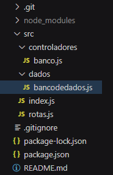

# Projeto Sistema Bancário - API REST

Este é um projeto de uma API REST para um sistema bancário desenvolvido em JavaScript usando o Express.js. Ele permite listar contas bancárias, criar novas contas, atualizar informações de contas existentes, deletar contas e realizar operações bancárias como depósitos, saques e transferências.

## Funcionalidades

- Listar contas bancárias
- Criar novas contas
- Atualizar informações de contas
- Deletar contas
- Realizar depósitos
- Realizar saques
- Realizar transferências
- Exibir saldo
- Exibir extrato

## Estrutura do Código

O código-fonte do projeto está organizado da seguinte maneira:



- `index.js`: O ponto de entrada do servidor Express.
- `rotas.js`: Define as rotas da API e seus controladores.
- `bancodedados.js`: Armazena os dados do banco e as funcionalidades relacionadas ao banco.

## Como Executar o Projeto

### Pré-requisitos

- Git instalado.
- Node.js instalado.
- Express.Js - framework instalado.
- Date-fns - biblioteca instalada.
- Nodemon - utilitário instalado.
- Insomnia ou outra ferramenta similar para testar a API.

### Passos para Executar o Projeto

1. Para executar o projeto no seu ambiente de desenvolvimento em execução, primeiramente faça o clone desse repositório em sua maquina local na pasta desejada:

 ```
   git clone https://github.com/seu-usuario/nome-do-repositorio.git
```


1. Acesse a pasta do projeto
cd nome-do-repositorio

2. Depois abra o projeto em seu editor de códigos, abra o terminal e digite o seguinte comando para a instalação dos pacotes e dependências necessárias:

```
npm install
```
3. Execute a aplicação em modo de desenvolvimento:

```
npm run dev
```

4. Use o Insomnia ou outra ferramenta similar para testar a API. Você pode importar as configurações do Insomnia a partir do arquivo insomnia.json neste repositório.

### 🔩 Endpoints da API Rest

Para testar a API use Insomnia ou Postman para fazer as requisições.

### Listar usuários da conta:

#### `GET` `/contas?senha_banco=Cubos123Bank`

Retorno (Aqui resumido para fins de demonstração):

```json
[
	{
		"numero": "1",
		"saldo": 220333,
		"usuario": {
			"nome": "Maria Jose",
			"cpf": "00011122233",
			"data_nascimento": "2021-03-15",
			"telefone": "71999998888",
			"email": "foo@bar.com",
			"senha": "1234"
		}
	}	
]
```

### Criar conta:

#### `POST` `/contas`

Requisição via json body.

```json
{
	"nome": "José Maria",
	"cpf": "11111111112",	
	"data_nascimento": "1990-01-01",
	"telefone": "83111111112",
	"email": "josemaria@cubos.com",
	"senha": "1234"
}

```
Retorno:

```
204 No Content
```

### Atualizar usuário da conta:

#### `PUT` `/contas/:numeroConta/usuario`

Requisição via json body.

```json
{
	"nome": "Sicrano Santos Silva",
	"cpf": "11111111112",	
	"data_nascimento": "1990-01-01",
	"telefone": "83111111112",
	"email": "sicrano@santossilva.com",
	"senha": "1234"
}

```

Obs.: No parâmetro da URL :numeroConta coloque o numero da conta que deseja alterar o usuário.

Retorno:

```
204 No Content
```

### Excluir Conta:

#### `DELETE` `/contas/:numeroConta`

Requisição - Sem json body

Na URL:
```
localhost:3000/contas/2?senha_banco=Cubos123Bank
```
Obs.: No parâmetro da URL :numeroConta coloque o numero da conta que deseja excluir.

Retorno:

```
204 No Content
```

### Depositar na conta:

#### `POST` `/transacoes/depositar`

Requisição via json body.

```json
{
	"numero_conta": "2",
	"valor": 250000
}
```

Retorno:

```
204 No Content
```

### Sacar da conta:

#### `POST` `/transacoes/sacar`

Requisição via json body.

```json
{
	"numero_conta": "2",
	"valor": 100000,
	"senha": "1234"
}
```

Retorno:

```
204 No Content
```

### Tranferir saldo entre contas:

#### `POST` `/transacoes/transferir`

Requisição via json body.

```json
{
	"numero_conta_origem": "2",
	"numero_conta_destino": "1",
	"valor": 15000,
	"senha": "1234"
}
```

Retorno:

```
204 No Content
```

### Saldo da conta:

#### `GET` `/contas/saldo?numero_conta=123&senha=123`

Requisição - Sem json body

Na URL:
```
localhost:3000/contas/saldo?numero_conta=2&senha=1234&senha_banco=Cubos123Bank
```

Retorno:

```json
{
	"saldo": 135000
}
```

### Extrato da conta:

#### `GET` `/contas/extrato?numero_conta=123&senha=123`

Requisição - Sem json body

Na URL:
```
localhost:3000/contas/extrato?numero_conta=2&senha=1234&senha_banco=Cubos123Bank
```

Retorno:

```json
{
	"depositos": [
		{
			"data": "2023-09-10 12:19:43",
			"numero_conta": "2",
			"valor": 250000
		}
	],
	"saques": [
		{
			"data": "2023-09-10 12:19:45",
			"numero_conta": "2",
			"valor": 100000
		}
	],
	"transferenciasEnviadas": [
		{
			"data": "2023-09-10 12:19:48",
			"numero_conta_origem": "2",
			"numero_conta_destino": "1",
			"valor": 15000
		}
	],
	"transferenciasRecebidas": [
		{
			"data": "2023-09-10 12:20:15",
			"numero_conta_origem": "1",
			"numero_conta_destino": "2",
			"valor": 10000
		}
	]
}
```

## Tecnologias Utilizadas

* [Node.js](https://nodejs.org/en) - Javascript runtime environment.
* [Express](https://expressjs.com/pt-br/) - Framework para aplicação Web do Node.js.
* [JavaScript](https://developer.mozilla.org/pt-BR/docs/Web/JavaScript) - Linguagem de programação utilizada neste projeto.

## Autor
**Romão Bernardo** - *Segundo projeto do curso de formação de Backend M02* - [romaobernnardo](https://github.com/romaobernnardo)

## Contribuir para o Projeto

1. Faça um fork do projeto.

2. Crie uma nova branch com as suas alterações:

```
git checkout -b minha-feature
```

3. Salve as alterações e crie uma mensagem de commit descrevendo o que você fez:

```
git commit -m "feat: Minha nova funcionalidade"
```

4. Envie as suas alterações para o GitHub:

```
git push origin minha-feature
```

5. Abra um Pull Request descrevendo suas alterações.

## Licença
Não se aplica a este projeto.

